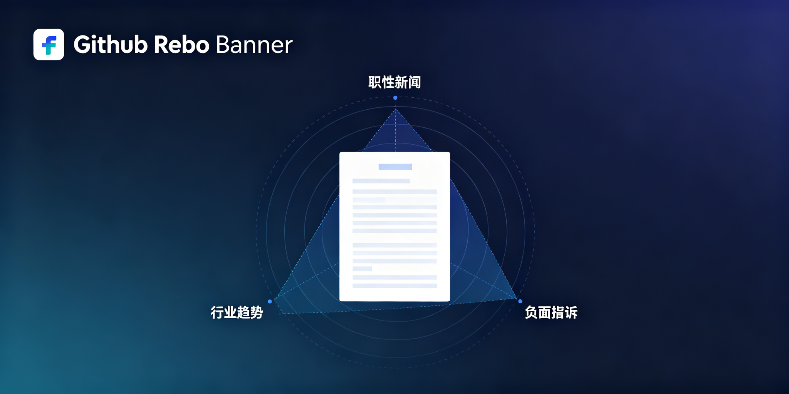

<div align="center">




# web-intelligence-reports

**多维度搜索→验证→结构化报告→飞书发布：品牌/竞品/舆情监控标准流程。**

<p>
  <a href="#"></a>
</p>

## 搜索三角度

```bash
# 正面
web_search("品牌名 评测 销量 2026")
# 负面
web_search("品牌名 投诉 维权 问题")
# 行业
web_search("品牌名 行业 趋势 对比")
```

三角度汇总→去重→验证→写报告→推飞书。

## License

MIT
